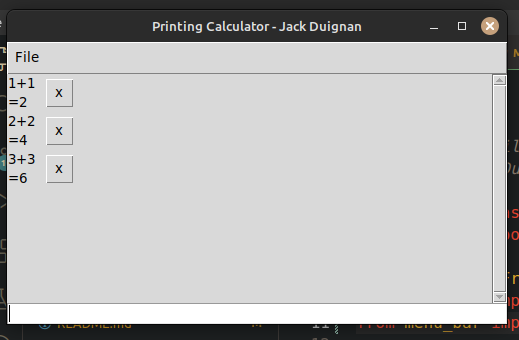

# PrintingCalc
# Description
A calculator with history that allows function use etc. this project takes inspiration from the speedCrunch app. But planes to extend upon it in the following ways:

- Add ability to delete equations that are unwanted.
- Add tabs so that calculations can have scope.
- Ability to add comments

These changes intend to turn the speedcrunch app, which is a pure calculator with functions and history, into more of a mathematical calculation suite that allows the user to have more control over how the maths in described.

# Installation
Clone the repository using:

```bash
git clone https://github.com/jaxsonpd/PrintingCalc.git
```
Then run main.py using python3:
```bash
python3 main.py
```

# Use
The current app supports
- Simple equations (python parsed) placed into the entry box at the bottom of the screen.
- Deleting of equations.

# Screenshots
The current interface:



# ToDo
## GUI
- [x] Stretch the equation block to fit screen.
- [x] Scroll windows scrolling.

## Functionality
- [ ] Add variables.
- [ ] Add comments.
- [ ] Add functions.
- [ ] Add Tabs.
- [ ] Custom equation parsing.
- [ ] Save the current tab to file.
- [ ] Export the current tab to plain text.

## Code
- [ ] Change comments to doc strings.
- [ ] Change all classes to not inherit from TK as then the get deleted when the GUI is deleted.
- [ ] Change create_equation to not place itself.