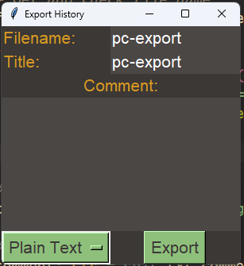

# PrintingCalc
# Description
A calculator with history that allows function use etc. this project takes inspiration from the speedCrunch app. But plans to extend upon it in the following ways:

- Add ability to delete equations that are unwanted.
- Add tabs so that calculations can have scope.
- Ability to add comments.
- The ability to edit equations.
- The ability to move equations around.

These changes intend to turn the speedcrunch app, which is a pure calculator with functions and history, into more of a mathematical calculation suite that allows the user to have more control over how the maths in described.

# Installation
Clone the repository using:

```bash
git clone https://github.com/jaxsonpd/PrintingCalc.git
```
Then run main.py using python3:
```bash
python3 ./src/main.py
```

# Use
The current app supports
- Simple equations (python parsed) placed into the entry box at the bottom of the screen.
- Deleting of equations.
- Scrollable history.
- Configurable colour schemes using json.
- Clear screen functionality
- Comment equations
- Saving of the calculation history in markdown and plain text.

# Screenshots
The current interface with equations, showing the delete button scrollbar and equation entry:


The export interface to allow for saving of calculations:

